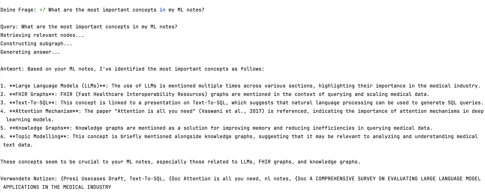

# G-Retriever for Obsidian

🧠 Chat with your Obsidian vault using Graph Neural Networks and Large Language Models. Ask questions, find connections, and get AI-powered answers based on your personal knowledge graph.

## Features

- 🔍 **Semantic Search**: Find relevant notes using advanced embeddings
- 🕸️ **Graph-Based Retrieval**: Uses PCST algorithm to find optimal connected subgraphs
- 💬 **Native Chat Interface**: Beautiful Obsidian plugin with real-time responses
- 🤖 **Local LLM**: Powered by Ollama - your data never leaves your machine
- 🎨 **Theme Aware**: Automatically matches any Obsidian theme
- 📊 **Two Modes**: Use untrained (fast) or train a GNN on your notes (better)

## Quick Start

1. Convert your vault to a graph
2. Generate training data with Ollama
3. Start the backend server
4. Enable plugin in Obsidian
5. Start chatting!

## Tech Stack

**Backend**: PyTorch Geometric, Sentence Transformers, NetworkX, Flask  
**Frontend**: Obsidian Plugin API (JavaScript)  
**LLM**: Ollama (llama3:8b)

Perfect for researchers, students, and knowledge workers who want to unlock the full potential of their notes. Happy about a https://ko-fi.com/mikelbahn ☕️